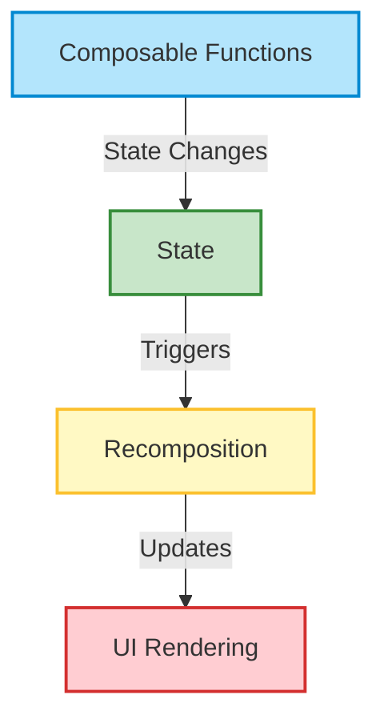

```mermaid
flowchart TD
    A[Composable Functions] -->|State Changes| B[State]
    B -->|Triggers| C[Recomposition]
    C -->|Updates| D[UI Rendering]

    style A fill:#B3E5FC,stroke:#0288D1,stroke-width:2px
    style B fill:#C8E6C9,stroke:#388E3C,stroke-width:2px
    style C fill:#FFF9C4,stroke:#FBC02D,stroke-width:2px
    style D fill:#FFCDD2,stroke:#D32F2F,stroke-width:2px
```
