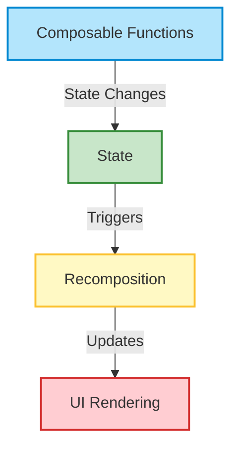

### 🔍 Diagram Breakdown:

- **Composable Functions**: These are the building blocks of the UI, written in Kotlin and annotated with `@Composable`.
- **State**: Represents the data that drives the UI. When state changes, it triggers recomposition.
- **Recomposition**: The process where Compose re-evaluates the affected composables and updates the UI accordingly.
- **UI Rendering**: The final step where the updated UI is drawn on the screen.

The arrows show the flow:
- **State Changes** → trigger recomposition
- **Triggers** → initiate recomposition logic
- **Updates** → lead to UI rendering

Would you like a downloadable version of this diagram or an explanation of how to implement this flow in a real app?
